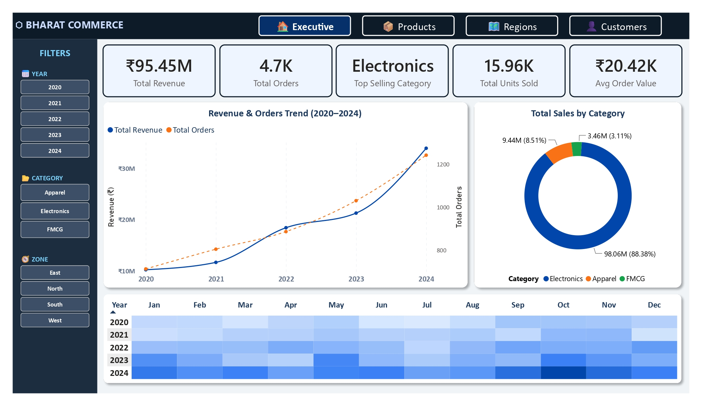
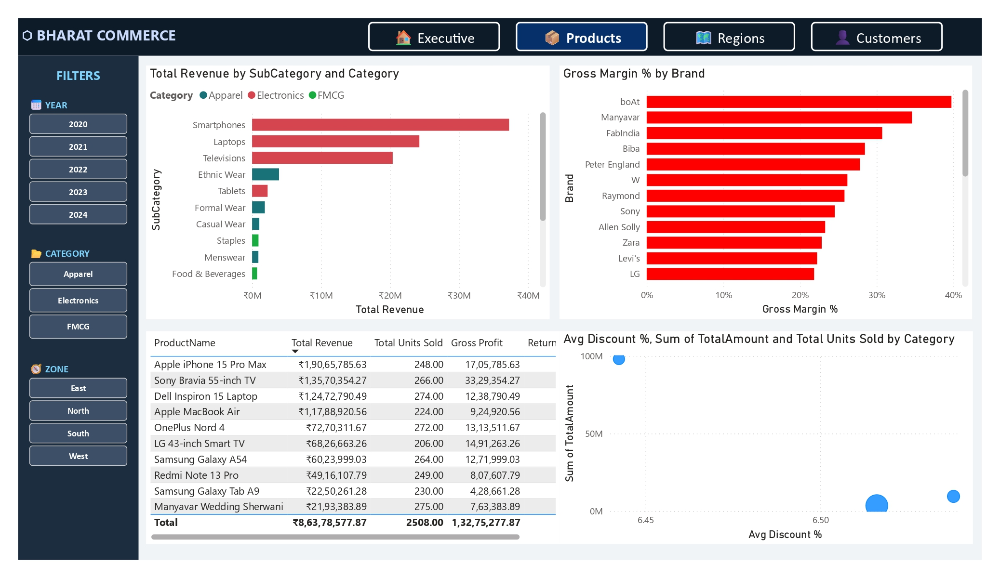
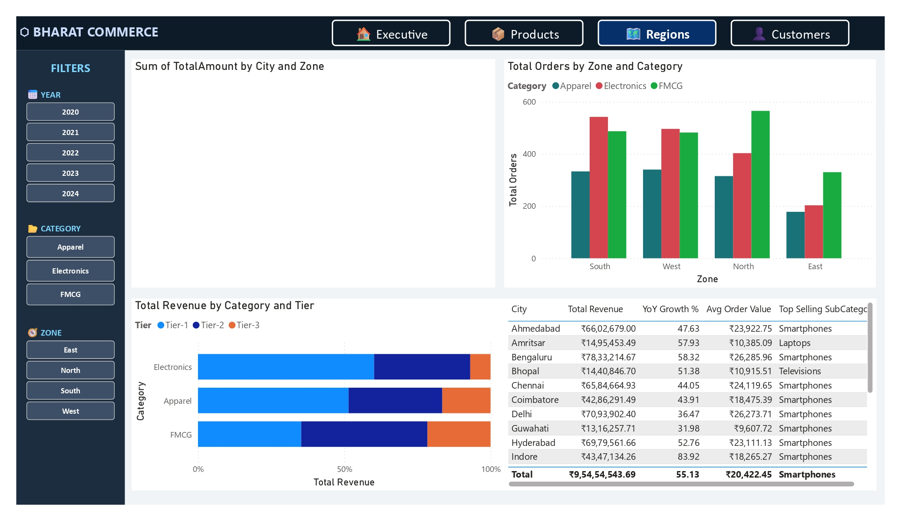
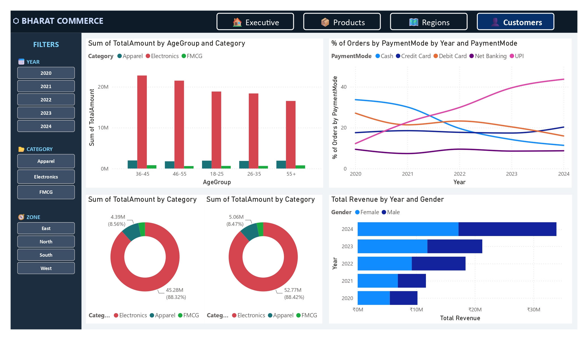

# 🛍️ Bharat Commerce: Sales & Revenue Analytics

A Power BI dashboard analyzing 5 years (2020–2024) of transactional data for a fictional pan-India retail conglomerate operating across **Electronics, FMCG, and Apparel & Fashion**, sold online and offline in 20 cities across all four zones of India.

Built on a **star schema**, driven entirely by **DAX measures**, and organized into 4 executive-facing dashboard pages.



---

## 📊 Project Highlights

| Metric | Value |
|---|---|
| Total Revenue (Delivered) | ₹9.55 Cr |
| Total Transactions | 5,500 |
| Delivered Orders | 4,674 |
| Top Category | Electronics |
| Cities Covered | 20 (Tier-1 / Tier-2 / Tier-3) |

---

## 🗂️ Dashboard Pages

| Page | Focus |
|---|---|
| 🏠 **Executive Summary** | Revenue/orders KPIs, YoY trend, category mix, monthly heatmap |
| 📦 **Product & Category Analysis** | Revenue by sub-category, brand margins, top products, discount impact |
| 🗺️ **Regional Sales Intelligence** | City/zone/tier performance, India map view |
| 👤 **Customer Behaviour & Payment Trends** | Age group, gender, payment mode shift (UPI adoption), retail vs. wholesale |

<details>
<summary>📸 More screenshots</summary>





</details>

---

## 🧱 Data Model (Star Schema)

```
DimCustomers ──┐                  ┌── DimProducts
               │                  │
               ▼                  ▼
        ┌─────────────────────────────────┐
        │      Fact_SalesTransactions     │
        │  OrderID | OrderDate | Quantity │
        │  UnitPrice | Discount% | Total  │
        │  PaymentMode | OrderStatus      │
        └─────────────────────────────────┘
               │                  │
               ▼                  ▼
          DimRegions          DimDate (Calendar, DAX-generated)
```

| Table | Rows | Role |
|---|---|---|
| `Fact_SalesTransactions.csv` | 5,500 | Fact table |
| `Products.csv` | 30 | Dimension |
| `Customers.csv` | 500 | Dimension |
| `Regions.csv` | 20 | Dimension |
| `DimDate` | N/A | Calculated in Power BI via `CALENDAR()` |

Relationships: all four are **Many-to-One** from the fact table, standard star schema (no snowflaking).

---

## 🧮 Key DAX Measures

```dax
Total Revenue   = CALCULATE(SUM(Fact_Sales[TotalAmount]), Fact_Sales[OrderStatus]="Delivered")
Total Orders    = COUNTROWS(FILTER(Fact_Sales, Fact_Sales[OrderStatus]="Delivered"))
Avg Order Value = DIVIDE([Total Revenue], [Total Orders], 0)
Gross Profit    = [Total Revenue] - [Total Cost]
Gross Margin %  = DIVIDE([Gross Profit], [Total Revenue], 0) * 100
YoY Rev Growth  = DIVIDE([Total Revenue]-[Revenue LY], [Revenue LY], 0) * 100
```

Full measure list, calculated columns, and slicer configuration are documented in
[`BharatCommerce_PowerBI_Project.docx`](BharatCommerce_PowerBI_Project.docx).

---

## 📁 Repository Structure

```
BharatCommerce/
│
├── README.md
├── BharatCommerce.pbix
├── BharatCommerce.pdf
├── BharatCommerce_PowerBI_Project.docx
│
├── data/
│   ├── SalesTransactions.csv
│   ├── Products.csv
│   ├── Customers.csv
│   └── Regions.csv
│
└── screenshots/
    ├── 01-executive-summary.jpg
    ├── 02-product-analysis.jpg
    ├── 03-regional-intelligence.jpg
    └── 04-customer-insights.jpg
```

---

## 🚀 How to Open

1. Install [Power BI Desktop](https://powerbi.microsoft.com/desktop/) (Windows only).
2. Clone this repo and open `BharatCommerce.pbix` directly. Data is embedded, so no re-import is needed.
3. To rebuild from scratch instead, import all 4 CSVs via **Get Data → Text/CSV**, then follow the step-by-step setup guide in the `.docx`.

---

## ⚠️ Known Notes / Data Caveats

This project went through a review pass before publishing. A few numbers in the write-up and presentation script don't reconcile with the underlying CSVs, and a few visuals in the `.pbix` don't fully match the design spec in the `.docx`. Flagging them here for transparency rather than leaving them silently baked into the story:

- The **"5,500 Total Orders"** KPI highlight is the raw transaction count; the actual `Total Orders` measure (Delivered only) evaluates to **4,674**.
- The presentation script's **Avg Order Value (₹1,734)** and **YoY growth (+18%)** don't match the data. Actual values are **~₹20,400 AOV** and **~+59% YoY (2023→2024)**.
- **Gross Profit** is defined two different ways across the doc (list price vs. actual discounted revenue) and neither matches the ₹2.8 Cr figure quoted in the script.
- The claim that **Wholesale AOV is ~3x Retail AOV** doesn't hold. Both are roughly ₹20,300 to ₹20,500 in the current dataset.
- A few Page 3/4 visuals (Zone Revenue chart, Gender Split donut, Customer Type split) are wired to slightly different fields than specified, and the page-level slicers (Brand, Margin Category, Tier, State, Age Group, Gender, Customer Type) from the design doc weren't built. Every page currently only has the 3 global slicers (Year, Category, Zone).

None of this affects the underlying data quality (referential integrity, calculations, and date ranges all check out). It's isolated to some narrative figures and a handful of visual bindings in the report layer.

---

## 🛠️ Tech Stack

`Power BI Desktop` · `DAX` · `Power Query` · `Star Schema Modeling`

---

## 📄 License

This project uses fictional, synthetically generated data for portfolio/demonstration purposes only. Feel free to fork and adapt.

---

*Bharat Commerce · Sales & Revenue Analytics · 2020–2024*
